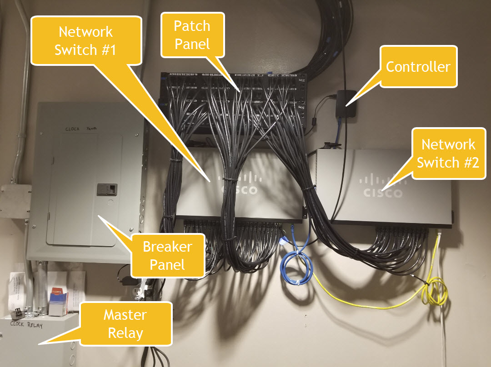

# De Harrak Clock Controller Software

This software runs on a Raspberry Pi and controls 72 independent digit panels attached to the same network as the Pi. 

Each digit panel is running the [LEDscape package](https://github.com/bigjosh/LEDscape) to drive the attached LEDs.

The master controller uses DNSMASQ to hand out IP addresses and maps those addresses to digits by MAC address using DNS entries in the `dhcp-hosts` file.

Each panel gets a DNS name that is mapped to its location on the clock. The top row of digits are `T01` - `T12`, and the bottom 5 rows are `B00` - `B59`.

# Operation

The clock runs continuously using the local linux time. The local time is disciplined using NTP whenever there is a connection to the internet. The timezone is set inside the `clockmode.sh` script, as are the colors for hours, minutes, seconds, and background. 

In the case when minutes and seconds are on the same digit, seconds win. 

The background is currently set to turn on at 8PM and off at 7AM. This saves a bit of power and wear as the dim background light is not visible during daylight.

# Layout

All of the wiring and controls are in the closet behind the front desk at 200 Water Street.



## Breaker Panel

[images/breaker panel.jpg]

!The breaker panel controls power to the clock. Each breaker controls several columns, which are labeled in sharpie. 

These are AFCI breakers, so they can half trip anytime there is a ground current detected. In this case, they need to be switched off and then on again to reset. 

There is a master relay to the left of the panel that turns off all circuits. There is a control switch for the master breaker outside on the botom right of the clock itself...


## Network

A sigle CAT5 network cable comes in from each digit box to the patch panel. There is then a patch cable that connects that digit to one of the swtiches. The switches are configured to run at 10Mbs/half. 

## Controller

The controller is a Raspberri Pi computer running Raspberian Linux and the software in this repo. 

The controller also connected to the switches and also has a Wifi connection to the internet via the Timer Warner Access point in the lobby. This internet connect is used to keep the local time acurate via NTP, and also provides remote access. 

# Troubleshooting

Listed expected order of likelyhood

## Column dark

Likely a blown breaker, probably after rain. Find the coresponding breaker on the panel and run the breaker reset proceedure below. 

## Single digit dark or stuck

First try reseting the whole column using the Breaker Reset proceedure below. If that does not work, then the panel is likely damaged and needs to be replaced with a spare. Sorry.

## Digits showing slow rainbow pattern

This pattern indicates that the sigit has lost its network connection with the controller. 

Check the entire netwrok path from the swicth to the digit. 

1) The patch cable from the switch to the patch panel
2) The punchdown on the back of the patch panel
3) The cable running up into the cieling and up over the roof (these cables are exposed to the elements!)
4) The connector inside the digit box
5) The plug going into the board on the digit panel 

## Breaker will not "stick" when turned on

Either...

1. There is still a wet short in the circuit. You might have to wait until a dry day. 
2. Dead breaker. Replace the breaker. 

## Wrong time

The controller lost its connection to the internet. Try rebooting the Timer Warner router in the lobby front desk. If the internet service has changed (front desk gets a different Wifi network), then you will need to TELNET onto the controller and update the nextwork config in the file `/etc/wpa_supplicant/wpa_supplicant.conf`.

# Nightly reset

There is a `chon` job that runs `midnight.sh` every night at midnight and restarts the `clockmode.sh` script every night...

```
00 00 * * * /home/pi/De-Harak-Clock-Controller/midnight.sh
``` 

Use `crontab -e` if you ever need to edit or re-add this line. 


# Installation

Easiest way to install is to use the release in this repo to flash a new SD card. Then `cd` into the repo and do a `git pull` to make sure everything is up to date.

Use `tzselect` to set the right timezone if necessary.

## Manual install

Copy the included dnsmasq.conf to /etc.

Make sure no other DCHP server is running (I'm looking at you dhcpdcd).

Make sure DNSMASQ is enabled to run at startup.

Use `sudo raspi-config` to disable graphical desktop on boot (boot into CLI).

# Starting up the clock

You should only need to do this after a power outage.

`cd` into the repo and run...

`./nh.sd clockmode.sh`

This runs the standard clock mode. The `nh` script runs it with `nohup` so it will keep running even after the terminal session ends. 

Then go look at the clock. You should see most digits looking like a clock, but a few with rainbow patterns. These digits did not successfully connect to the network on boot (see [here](https://groups.google.com/forum/#!topic/beagleboard/9mctrG26Mc8%5B176-200%5D) for info). To fix these digits, they must be repowered. Find a column on the clock that has one or more unconnected digits and then find the circuit breaker that controls that column. Run the breaker reset proceedure below.

# Breaker Reset Proceedure

1. Switch the breaker off (all the way to the right) until it clicks.
2. Count to 3-Mississippi. You want a full 3 seconds here so don't rush. 
3. Wwitch the breaker back on (to the left) until it clicks. If it does not click satisfingly, then see troubleshooting above. 
4. Give the column a minute to boot
5. Go out to the clock and check the digits in the reset column(s). If any are still showing the rainbow pattern, then repeat starting at step #1 until all digits are showing the clock pattern. 

# Running demos

There are lots of demos and test patterns available. The `nh.sh` will automatically stop whatever script is currently driving the display (typically `clockmode.sh`) and run the specified script. 

For example, to start the sinbowwave pattern (a sinbow is a rainbow by with sine shaped color curves), you'd enter...

```
./nh.sh sinbowwave.sh
```

Always remember to [restart clock mode](#start) when you are done!
 

# Replacing a digit panel

All panels are identical, so can easily be swapped out with spares in case of problems. 

Once a digit has been swapped, you need to update the DHCP/DNS entry for the MAC address of the new panel to map to the correct location on the clock. To do this, on the Pi command line run...

`digitpicker.sh`

Scroll though and find the old panel that was located in the replaced position and change the name to something like `deadH20`. Next look for an entry with a name like `beaglebone` or `*` rather than a good name. This is likely the new panel. Hit enter and the digit should blink on the clock. Next enter the correct DNS name for this position (i.e. `H20`) and press enter. Then save the file and restart the clockmode program so the changes take effect. 

# Backdoor

There is a hidden wifi access point in the digit 57 box to give direct access to the internal network from in front of the clock. This can be helpful in cases where you are trying to find a digit and the wifi in the lobby is not working.  SSID and key are written on paper inside the binder in the clock equipment room. 

# Extending the display

There are several scripts showing examples of how to update the display for modes other than clock. All use OPC over UDP to set the pixels in each digit. `ticktest.sh` is a good place to start. It lights up each digit in sequence with red, green, blue, and white. Note that you can use any RGB color. To run `ticktest`, enter...

`./nh.sh ticktest.sh`

For more complicated displays, C is likely faster than shell scripts. The beginnings of some C drivers are in `maptest.c`. 

# Getting a diagnostic view of the digit statuses

You can use the `checkdigits.sh` script to get a quick overview of which digits are working...

```
pi@raspberrypi:~/De-Harak-Clock-Controller $ ./checkdigits.sh
H means host not found in DNS
P means fialed to ping

  h01  Hh02H  h03   h04  Hh05H  h06  Hh07H Hh08H  h09   h10  Hh11H  h12
  m00  Hm01H  m02   m03  Hm04H  m05  Hm06H Hm07H  m08   m09  Hm10H  m11
  m12  Hm13H  m14   m15  Hm16H  m17  Hm18H Hm19H  m20   m21  Hm22H  m23
  m24  Hm25H  m26   m27  Hm28H  m29  Hm30H Hm31H  m32   m33  Hm34H  m35
  m36  Hm37H  m38   m39  Hm40H  m41  Hm42H Hm43H  m44   m45  Hm46H  m47
  m48  Hm49H  m50   m51  Hm52H  m53  Hm54H Hm55H  m56   m57  Hm58H  m59
pi@raspberrypi:~/De-Harak-Clock-Controller $

```

In this view, for example, digits `h01` and `m17` are working fine but `h11` and `m10` do not have DNS entries (yikes!!!). 

Looking at the above pattern of completely dead columns, it seems likely that a couple of blown breakers is the cause. In this case, use the 3-Mississippi procedure above on each breaker to to reset it. 

# The `nextsecond` utility

This simple utility sleeps until the next second on the clock. If it is 10:55:22.75 and you run `./nextsecond`, then it will sleep for about 0.25 seconds. 

The clock uses this to always start an update at the top of a second.

You can test that it works by running...

`./nextsecond; date "+%N"`

It will print the number of nanoseconds since the last round second> I should always be < 010000000, which is 10,000,000ns, which is 10ms. 

# Accessing individual digits remotely 

From the controller, you can `ssh` onto the digits like this...

```
ssh -l root m20
```

...where `m20` is the digit you want. No password needed.

